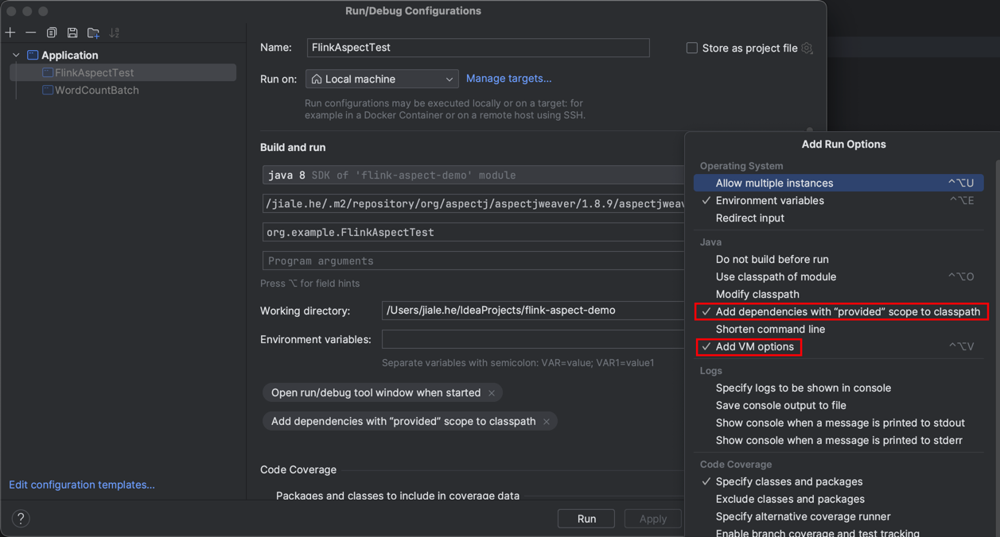

# flink-aspect-demo

## Usage
### IDEA

set configuration



`VM Options  -javaagent:/path/to/aspectjweaver-1.8.9.jar`

### Flink Application

```shell
cp /path/to/aspectjweaver-1.8.9.jar ${FLINK_HOME}/lib

flink \
run-application \
-t yarn-application \
-Denv.java.opts.jobmanager="-javaagent:lib/aspectjweaver-1.8.9.jar" \
-c org.example.FlinkAspectTest \
file:///home/omm/hejiale/flink-aspect-demo-1.0-SNAPSHOT.jar hdfs://hacluster/user/omm/user.csv
```

